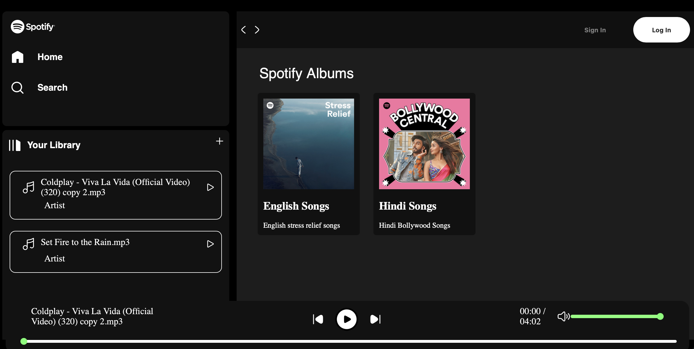

# spotify-ui-Clone
Spotify-inspired music player built using HTML, CSS, and JavaScript. This was my first web development project, focused on learning UI design, basic music controls, and DOM manipulation.

## 📖 Project Description
This project is a Spotify-inspired music player built using **HTML, CSS, and JavaScript**. It is my **first web development project**, created while learning the basics of front-end development. The main objective of this project was to understand how web pages are structured, styled, and made interactive using core web technologies.

The application features a clean and simple user interface inspired by Spotify and includes basic music player functionalities such as play, pause, and track navigation. Working on this project helped me gain hands-on experience with web layouts, CSS styling, JavaScript logic, and DOM manipulation.

---

## 🛠️ Tech Stack
- **HTML** – for structuring the web pages  
- **CSS** – for styling and layout design  
- **JavaScript** – for adding interactivity and music player functionality  

---

## ✨ Features
- Play and pause audio tracks
- Navigate between songs
- Spotify-inspired user interface
- Responsive design for different screen sizes
- Beginner-friendly and lightweight implementation

---

## 📸 Screenshots

Example:

